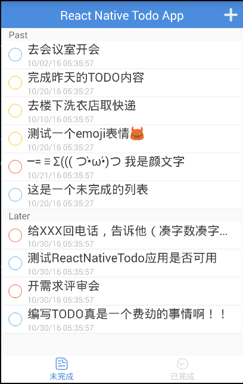
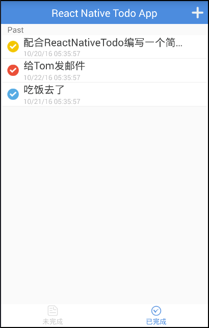
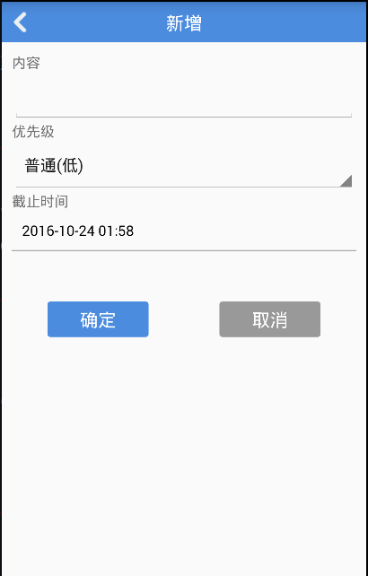
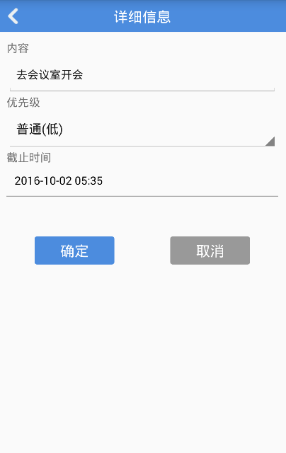

# ReactNative Todo App

用ReactNative做的简单的Todo应用。目前只支持Android平台，iOS暂时不支持。


**注意：该应用中App的代码主要在app目录中，同时，server中提供了一个简单的koa server，木有持久化操作(每次重启数据都会初始化)，只是为了配合App做演示。**


## 用法

1. 安装依赖启用服务器

	```
	npm install
	npm run server     //启用server，监听在9001端口
	```

2. 修改App中请求地址

	在`app/actions.js` 中的第一行，将`HOSTNAME`修改成自己电脑的IP

3. 启动应用

	```
	react-native run-android
	```


## 截图







